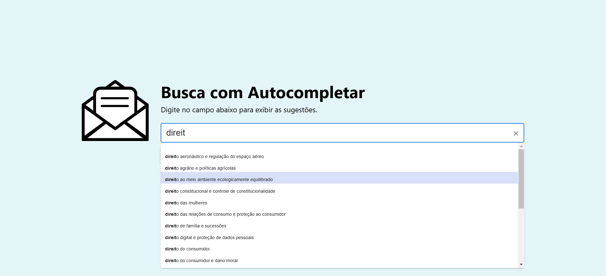

# Autocomplete
This project implements an website with an autocomplete box using GraphQL and Elasticsearch.

More information at [back-end](./back) and [front-end](./front) directories.

**Author:** Jean Loui Bernard Silva de Jesus

## Getting Started
The entire project has been built to run entirely on [Docker](https://www.docker.com/). 

Create a `.env` from `.env.sample` and execute the command below to run the application:
```
docker-compose up
```
You can also populate the application automatically setting `seed=true` at `.env`.


## Application Preview
Check out the preview below:

### First contact on the home page


### Autocomplete Suggestions
